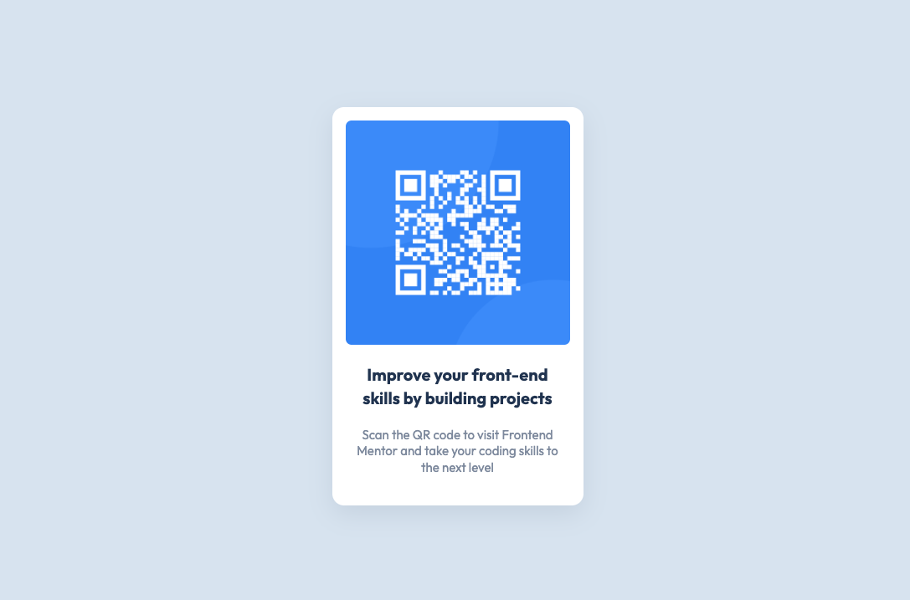

# Frontend Mentor - QR code component solution

This is a solution to the [QR code component challenge on Frontend Mentor](https://www.frontendmentor.io/challenges/qr-code-component-iux_sIO_H). Frontend Mentor challenges help you improve your coding skills by building realistic projects.

## Table of contents

- [Overview](#overview)
  - [Screenshot](#screenshot)
  - [Links](#links)
- [My process](#my-process)
  - [Built with](#built-with)
  - [What I learned](#what-i-learned)
- [Author](#author)

## Overview

### Screenshot

### Links

- Live Site URL: [QR Code challenge - Netlify](https://qr-challenge-fm.netlify.app/)

## My process

- First of all, review requirements
- Then, write the markup
- Next, write some styles
- Finally, review the final result and upload solution

### Built with

- Semantic HTML5 markup
- CSS custom properties
- BEM Methodology
- Flexbox

### What I learned

I was just "moving my hands" a little bit and practicing some HTML & CSS

## Author

- LinkedIn - [Jeremías Aragón Bonilla](https://www.linkedin.com/in/jeremiasaragon/)
- Frontend Mentor - [@JeremiasAragon](https://www.frontendmentor.io/profile/JeremiasAragon)
- Twitter - [@JeremyAragon95](https://twitter.com/JeremyAragon95)
